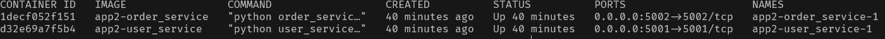

# BIS 471/571 - Docker Demonstration


## Definitions
- **Docker**: Docker is an open-source platform that enables developers to build, package, and distribute applications in containers.
- **Containers**: A container is a lightweight, portable, and isolated environment that runs an application along with all its dependencies, libraries, and configurations.

## Uses For Docker Containers
- Running microservices architectures
- Creating development and testing environments that match production (CI/CD)
- Deploying Cloud-Native applications seamlessly between different providers 

## Docker File
The **docker file** is the **blueprint** for the container. It is a script that **defines and automates** the process of building a docker image. It contains **instructions** on how to set up the **environment, install dependencies and configure** the application inside a docker container. There is a lot you can do to customize your container using the docker file but typically the basic structure is as following:

- ```FROM``` Specify a base image. There is a plethora of already create base image that can be found on [docker hub](https://hub.docker.com/). You traditionally with start with a image that has some core functionality that you need. For example if you are creating a python application you would start with the python image. 
- ```WORKDIR``` Set the working directory. This tells docker where the subsequently defined command should be run. 
- ```COPY``` Copies local files. This tells docker what files it should copy over into the container. 
- ```RUN``` Installs dependencies. This command will be followed by what needs to be run in install the dependencies of the project. 
- ```EXPOSE``` Exposes a port for the application. If we know our application will be using a specific port, then we explicitly expose that port here. 
- ```CMD``` Defines the command that will be used to run the application. This line will be proceeded by the command to run along with the file it should be run on. 


## How to Make a Docker Container
### 1. [**Install Docker**](https://docs.docker.com/desktop/setup/install/windows-install/)
Following the link and download docker desktop. This will download both the GUI and CLI along with all functionality needed to create and run a container. 


### 2. **Create Application**
This could be any application but in this example we are just using Flask which is a web framework written in python. 
```
from flask import Flask

app = Flask(__name__)

@app.route("/")
def home():
    return "Hello, Docker!"

if __name__ == "__main__":
    app.run(host="0.0.0.0", port=5000)
```

### 3. **Create Dependencies text file**
Create a file in the same directory that list all of the necessary requirements. In out example we only need the flask library. 
```
flask
```

### 4. **Create Docker File**
Create the docker file that will function as the blue print for this container. Anyone with this docker file will be able to recreate an identical container and run the application on any device. 
```
# Start with official Python image
FROM python:3.9

# Set the working directory inside the container where all other commands will be run
WORKDIR /app

# Copy the project files to the container
COPY . .

# Install dependencies
RUN pip install -r requirements.txt

# Expose the application port 
EXPOSE 5000

# Define the command to run the app
CMD ["python", "app.py"]
```

### 5. **Build Docker Image**
Run the following command inside the project folder. This can also be done via the GUI on docker desktop. This command will find the DockerFile and use the information inside of it to create the container. 
```
docker build -t my-flask-app .
```
- ```-t``` allows us to name the container
- ```.``` tells docker to use the current directory as build context

You can check built images using this command
```
docker image ls
```
### 6. **Run the Container**
The following command will run the container that has just been built
```
docker run -d -p 5000:5000 --name my-running-app my-flask-app
```
- ```-d``` tells docker to run the container in the background
- ```p- 5000:5000``` maps host port 5000 to container's port 5000
- ```--name my-running-app my-flask-app``` assigns a name to the running container

Now we can check if the container is running using

``` docker ps```

If the container is running, we can access [http://localhost:5000](http://localhost:5000) we should see our text from our python program displayed


## Another Example (Microservices)
This example will highlight the microservice capabilities of docker containers. We will build a small application with two separate services 
1. **user_service** that provides user data
1. **order_service** that fetches data about a users order

Here is a guide of the file structure for this example
```
Docker-Demo/
│── app2/
│   ├── user/
│   │   ├── user_service.py  # Python file for user data
│   │   ├── Dockerfile       # Builds container for user_service
│   ├── order/
│   │   ├── order_service.py # Python file for order data
│   │   ├── Dockerfile       # Builds container for order_service
│   ├── docker-compose.yml   # Configures both services and runs them together
```

### Application Files
As seen above, we have two Python file (user_services & order_services) that fulfill two different purposes. Each service is run on a different port. 

#### **user_service**
```
from flask import Flask, jsonify

app = Flask(__name__)

@app.route("/users")
def get_users():
    return jsonify(users=["Alice", "Bob", "Charlie"])

if __name__ == "__main__":
    app.run(host="0.0.0.0", port=5001)
```

#### **order_service**
```
from flask import Flask, jsonify
import requests

app = Flask(__name__)

@app.route("/orders")
def get_orders():
    users = requests.get("http://user_service:5001/users").json()
    return jsonify(orders=[{"user": user, "order": "Laptop"} for user in users["users"]])

if __name__ == "__main__":
    app.run(host="0.0.0.0", port=5002)
```

### Docker Files
Each one of these services will run in its own dedicated docker container. Therefore, each file will need its own docker file to configure its container. As you can see these files are identical except for the port that is exposed. 

#### **user_service Dockerfile**
```
FROM python:3.9

WORKDIR /app

COPY . .

RUN pip install flask

EXPOSE 5001

CMD ["python", "user_service.py"]
```

#### **order_service Dockerfile**
```
FROM python:3.9

WORKDIR /app

COPY . .

RUN pip install flask requests

EXPOSE 5002

CMD ["python", "order_service.py"]
```

### Docker Compose File
The ```docker-compose.yml``` file allows us to orchestrate both docker container so they run together and can communicate. It accomplishes this by the following:

- Defines each service individually (user_service & order_service) 
- Specifies the build folder for each separate docker file
- Exposes the respective port each service will run on
- Connects the two on the same docker network
    - **Docker Network** is a feature that allows Docker containers to connect with each other and with external systems
```
version: '3.8'

services:
  user_service:
    build: ./user
    ports:
      - "5001:5001"
    networks:
      - mynetwork

  order_service:
    build: ./order
    ports:
      - "5002:5002"
    depends_on:
      - user_service
    networks:
      - mynetwork

networks:
  mynetwork:
```


### Running
Everything is run out of ```docker-compose.yml``` file so to run everything we just need to build this file.

```
docker-compose up -d
```

We can verify everything is running with ```docker ps``` and should see the following



### Testing
Since this is a web API we can test this using the curl command. We will curl localhost at the port for each service and specify the end point's name (users/orders).

```
curl http://localhost:5001/users
```


```
curl http://localhost:5002/orders
```


### Why This is Beneficial

#### 1. Each microservice runs in its own container meaning if ```order_service``` goes down or needs an update we don't need to redeploy ```user_service```

#### 2. Each container can be scaled up separately. For example if ```order_service``` is getting heavier traffic than ```user_service``` we can use ```docker-compose up --scale order_service=3 -d``` to easily run more containers and meet the different demands of each service. 

